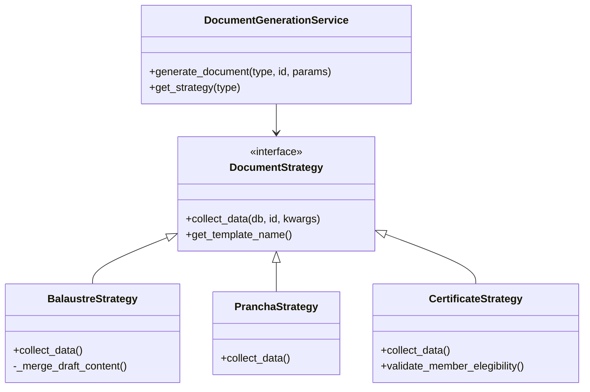

# Módulo de Personalização de Documentos (Visão Técnica)

## 1. Arquitetura da Solução
O módulo de geração de documentos foi refatorado para utilizar o padrão de projeto **Strategy**, desacoplando a lógica de orquestração (`DocumentGenerationService`) das regras de negócio específicas para cada tipo de documento (Balaústres, Convocações, Certificados).

### 1.1 Diagrama de Classes Simplificado


### 1.2 Componentes Chave
- **Strategy Registry**: Dicionário centralizado no serviço que mapeia chaves (`'balaustre'`, `'convite'`) para instâncias das estratégias.
- **Contexto Unificado**: Todas as estratégias retornam um dicionário de contexto padronizado para o Jinja2, garantindo que o template renderize corretamente independente da fonte de dados.
- **Cache de Assets**: Implementado `lru_cache` para leitura de imagens e fontes (Base64), otimizando a performance em gerações em lote.

## 2. Estrutura de Pastas e Arquivos
```
backend/
├── services/
│   ├── document_generation_service.py  # Orquestrador (Contexto)
│   └── document_strategies/
│       ├── base_strategy.py            # Classe Abstrata
│       ├── balaustre_strategy.py       # Lógica do Balaústre
│       ├── prancha_strategy.py         # Lógica de Editais
│       ├── certificate_strategy.py     # Lógica de Certificados
│       ├── invitation_strategy.py      # Lógica de Convites
│       ├── congratulation_strategy.py  # Lógica de Cartões de Congratulações
│       └── electoral_balaustre_strategy.py # Lógica de Atas Eleitorais
├── templates/
│   ├── balaustre_template.html         # Template Jinja2 (Balaústre)
│   ├── edital_template.html            # Template Jinja2 (Prancha)
│   ├── certificate_template.html       # Template Jinja2 (Certificado/Convite)
│   ├── invitation_template.html        # Template Jinja2 (Convite Dedicado)
│   └── congratulation_template.html    # Template Jinja2 (Congratulações)
```

## 5. Novos Módulos de Documentos (Expandido)
### 5.1 Convite (InvitationStrategy)
- Geração de convites formais para sessões magnas.
- Utiliza template `invitation_template.html` ou `certificate_template.html` (modo paisagem).
- Endpoint: `/generate-invitation`.

### 5.2 Cartão de Congratulações (CongratulationStrategy)
- Documento para parabenizar membros (aniversário, exaltação).
- Utiliza `congratulation_template.html`.
- Suporta mensagem personalizada via `kwargs.custom_message`.

### 5.3 Balaústre Eleitoral (ElectoralBalaustreStrategy)
- Variação do Balaústre focada em sessões de Eleição.
- Registra escrutínios, chapas concorrentes e resultado.
- Endpoint: `/generate-electoral-balaustre`.

## 3. Segurança e Rastreabilidade
- **Geração de Hash**: Utiliza SHA-256 combinando `ID_Sessao + UUID + Timestamp` para criar uma assinatura digital única.
- **Persistência**: Assinaturas são salvas na tabela `document_signatures`, vinculadas ao usuário emissor.
- **Validação Pública**: O QR Code gerado nos documentos aponta para uma rota pública de validação que verifica a integridade do Hash.

## 4. Pontos de Extensão (Como adicionar novos documentos)
Para adicionar um novo documento (ex: "Declaração de Regularidade"):
1. Crie uma classe `RegularityDeclarationStrategy` herdando de `DocumentStrategy`.
2. Implemente `collect_data` para buscar os dados financeiros/frequência do membro.
3. Crie o template `regularity_template.html`.
4. Registre a nova estratégia no `DocumentGenerationService.__init__`.

---

## 5. Manutenção e Troubleshooting
- **Erro "Template Not Found"**: Verifique se `strategy.get_template_name()` retorna o nome exato do arquivo em `backend/templates/`.
- **Erro de Validação Pydantic**: Se a geração falhar silenciosamente, verifique se o JSON `document_settings` da Loja está em conformidade com o schema `DocumentSettings`. O sistema faz *fallback* para configurações padrão, mas loga o erro.

## 6. Configuração de Cabeçalho e Layout
O sistema de cabeçalhos foi arquitetado para máxima flexibilidade e consistência, utilizando um único template mestre (`header_master.html`) controlado por modos de layout.

### 6.1 Modos de Layout (Backend)
O arquivo `header_master.html` processa variáveis de contexto baseadas no campo `header_config.layout_mode`:
- **timbre**: Exibe apenas o logo centralizado.
- **classic**: Logo à esquerda, textos (Título/Subtítulo) à direita ou centralizados.
- **inverted**: Texto à esquerda, logo à direita.
- **double**: Dois logos (lateral esquerda e direita), com texto centralizado.
- **centered_stack**: Logo no topo, seguido pelos textos abaixo (vertical).

### 6.2 Sobrescrita de Texto
Permite que o usuário defina textos fixos, ignorando as variáveis dinâmicas:
- `custom_title_text`: Substitui o nome da loja padrão.
- `custom_subtitle_text`: Substitui as linhas de afiliação/jurisdição.

### 6.3 Schema `HeaderConfig`
Atualizado para incluir:
- `layout_mode`: Literal['timbre', 'classic', 'inverted', 'double', 'centered_stack']
- `image_opacity`: Controle de transparência para imagens de fundo.
